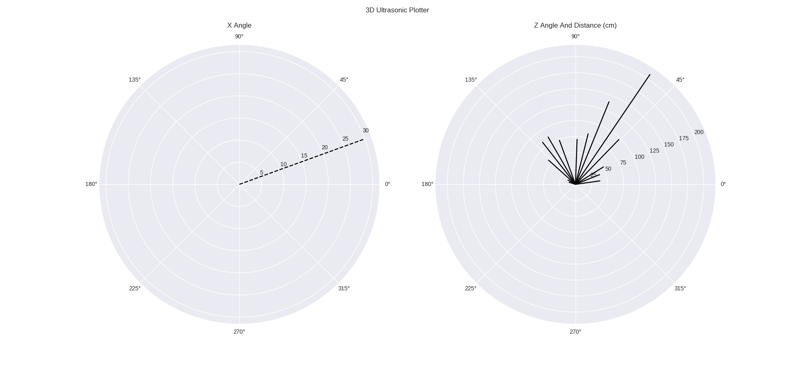
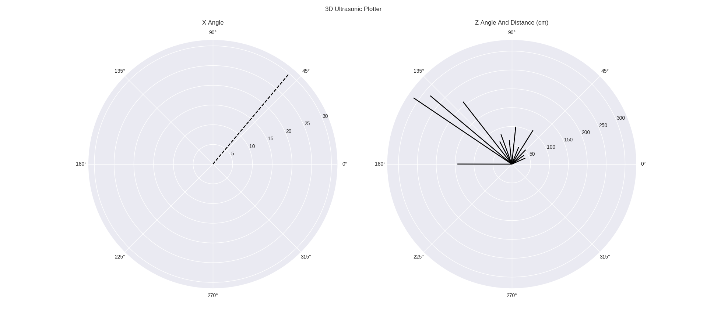

  <h1>Arduino 3D_ultrasonic</h1>
  
<h3 align="center">3d space ultrasonic distance plotter 🚀</h3>

## Includes
- Arduino Firmware
- python gui for graphs plotting

## Components
- Arduino Uno
- 2x Servo Motor
- ultrasonic Sensor (HC-SR04)

# 📝 Documentation

# 📚 References

# 🤝🏻 Connect with Me

# 📜 License

Licensed under the GPL3 License, Copyright 2025 Huzaifa Irfan. [LICENSE](LICENSE)
